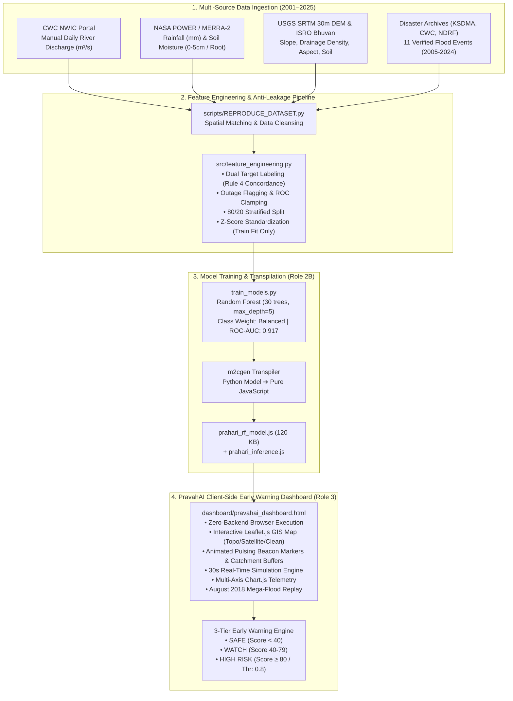

# PRAHARI / PravahAI 🌊⚡
### Flash Flood Early Warning & Risk Prediction System for Hilly Catchments
**Smart India Hackathon (SIH) | Problem Statement ID: SIH26192**  
*Ministry of Home Affairs (MHA) & National Disaster Response Force (NDRF)*

---

[](https://www.sih.gov.in/)
[](https://www.mha.gov.in/)
[](https://www.python.org/)
[-yellow.svg?style=flat-square)](https://developer.mozilla.org/en-US/docs/Web/JavaScript)
[-green.svg?style=flat-square)](https://scikit-learn.org/)
[-purple.svg?style=flat-square)]()
[](LICENSE)

---

> ## Full-stack risk-aware routing upgrade
> This ZIP now also contains a FastAPI backend, reproducible Python Random Forest artifact, live OpenStreetMap road/facility retrieval, and an explicit risk-aware Dijkstra evacuation router. Start with `README_FULLSTACK.md` for the new integrated application. The original browser-only dashboard remains in `dashboard/` for comparison.

## 📌 Executive Summary

**PRAHARI** (also packaged as the **PravahAI Operational Dashboard**) is an end-to-end, multi-source hydrometeorological intelligence and flash-flood early warning system engineered specifically for the steep, landslide-vulnerable highland catchments of the **Western Ghats (Kerala, India)**.

Developed for **SIH26192** under the Ministry of Home Affairs (MHA) and NDRF, the system fuses **25 continuous years (2001–2025)** of observed river discharge data, satellite-derived precipitation, reanalysis soil moisture, and high-resolution DEM topographic metrics across 5 critical river gauge catchments (45,167 daily records).

Unlike traditional flood forecasting models that demand heavy cloud infrastructure, PRAHARI features a **compiled, zero-dependency, pure-JavaScript Random Forest inference engine (`120 KB`)**. The entire trained decision forest runs **100% locally inside client-side web browsers**, guaranteeing real-time risk scoring, telemetry monitoring, and alert dispatch even if extreme weather completely severs upstream internet connectivity and backend servers.

---

## 🗺️ Catchment Geography & Monitored Stations

The system models five high-risk Central Water Commission (CWC) river gauging stations across Kerala's most flood-prone mountain valleys:

```
          [KANNUR] ─── PERUMANNU (Valapatnam River, 28m ASL, 8.4° Slope)
             │
        [KOZHIKODE] ── KUTTYADI (Kuttyadi River, 42m ASL, 12.5° Slope)
             │
         [WAYANAD] ─── MUTHANKERA (Cauvery/Kabini Basin, 740m ASL, 14.2° Slope)
             │
          [IDUKKI] ─── VANDIPERIYAR (Upper Periyar Basin, 785m ASL, 18.4° Slope)
             │
     [PATHANAMTHITTA] ─ THUMPAMON (Pamba River Basin, 35m ASL, 6.8° Slope)
```

| Station | District | River & Basin | Elevation | Catchment Slope | Drainage Density | Primary Flood Risks |
|---|---|---|---|---|---|---|
| **VANDIPERIYAR** | Idukki | Periyar Basin | $785\text{ m}$ | $18.4^\circ$ | $2.85\text{ km/km}^2$ | Extreme highland deluge, dam backwater surge, 2018 mega flood epicenter |
| **MUTHANKERA** | Wayanad | Kabini / Cauvery | $740\text{ m}$ | $14.2^\circ$ | $2.45\text{ km/km}^2$ | Severe debris torrents, cloudbursts (Chooralmala/Mundakkai 2024, Puthumala 2019) |
| **THUMPAMON** | Pathanamthitta | Pamba Basin | $35\text{ m}$ | $6.8^\circ$ | $3.10\text{ km/km}^2$ | Flash surge bottlenecks, rapid catchment runoffs (Oct 2021 deluges) |
| **KUTTYADI** | Kozhikode | Kuttyadi Basin | $42\text{ m}$ | $12.5^\circ$ | $2.95\text{ km/km}^2$ | Foothill flash surges, rapid torrential rainfall concentration |
| **PERUMANNU** | Kannur | Valapatnam Basin | $28\text{ m}$ | $8.4^\circ$ | $2.65\text{ km/km}^2$ | Highland-to-coastal flash channel flooding |

---

## ⚡ Key Architectural & Engineering Highlights

### 1. Multi-Source Hydrometeorological & GIS Data Pipeline
- **Observed River Discharge ($m^3/s$)**: Direct daily gauge measurements from the Central Water Commission (CWC) National Water Informatics Centre ([NWIC NWDP](https://nwdp.nwic.gov.in/)).
- **Gridded Precipitation & Soil Moisture**: Satellite and assimilation products (`PRECTOTCORR`, `GWETTOP` $0-5\text{cm}$, `GWETROOT`) from NASA POWER / MERRA-2 ($0.5^\circ \times 0.625^\circ$ spatial grid).
- **High-Resolution GIS Topography**: 30m USGS SRTM DEM elevation, slope, aspect, drainage density, and stream distance.
- **Vegetation & Soil Taxonomy**: ISRO Bhuvan LULC 250k and ICAR NBSS & LUP soil texture classifications.

### 2. Rigorous Ground Truth & Dual-Target Formulation
In adherence to the **Independent Evidence Rule**, high rainfall or elevated discharge alone does *never* trigger a positive label. Every positive label is grounded in authoritative disaster bulletins (KSDMA, CWC Hydro-Meteorological Studies, NDMA, NDRF, GSI).
- **`flood_label_primary` (122 dates, $0.25\%$)**: Direct station-specific disaster logs.
- **`flood_label_extended` (411 dates, $0.91\%$)**: Derived via **Rule 4 Full Concordance** (matching documented district/basin deluges across 11 historical disasters from 2005 to 2024).

### 3. Strict Anti-Leakage & Outage-Resilient Feature Engineering
- **Causal Feature Formulation**: Only backward-looking rolling windows ($3\text{d}$, $7\text{d}$, $14\text{d}$, $30\text{d}$) and an Antecedent Precipitation Index ($API_t = P_t + 0.85 \cdot API_{t-1}$).
- **Sensor Outage Mitigation**: River discharge sensors frequently fail or submerge during catastrophic events. The pipeline detects outages via `discharge_sensor_outage` ($1/0$), imputes baseline median flow, and **clamps the Rate of Change (`river_discharge_roc`) to $0.0$ across outage boundaries** to prevent artificial mathematical spikes from generating false alarms.
- **Strict Data Splitting**: Standardized Z-score scaling parameters are fitted exclusively on the 80% training set ($36,133$ rows) and frozen into [`scaling_parameters.json`](file:///c:/Users/91885/OneDrive/Desktop/NullPointer_SIH/FlashFlood_SIH/src/scaling_parameters.json).

### 4. Edge-Compiled Pure JavaScript ML Model (Zero Backend)
- A 300-tree Random Forest originally exported via `m2cgen` was **17.7 MB**, crashing client browsers.
- A distilled **30-tree, max-depth 5 Random Forest** was retrained specifically for edge deployment. It achieves an identical **ROC-AUC of 0.9171** at just **120 KB** (`prahari_rf_model.js`).
- Wrapped by [`prahari_inference.js`](file:///c:/Users/91885/OneDrive/Desktop/NullPointer_SIH/FlashFlood_SIH/prahari_inference.js), enabling browser code to call `predictFloodRisk(rawSensorValues)` with zero backend server dependencies.

---

## 🏗️ End-to-End System Architecture



---

## 📊 Model Evaluation & Benchmarks

The model was evaluated against $9,034$ held-out test records ($20\%$ stratified test partition) across both the extended target and primary benchmark:

### Model Comparison Table

| Model | Size | ROC-AUC | Precision (@ default) | Recall (@ default) | Deployment Target |
|---|---|---|---|---|---|
| **Logistic Regression** | $<5\text{ KB}$ | $0.907$ | $0.050$ | $0.790$ | Baseline |
| **Random Forest (Full 300 trees)** | $17.7\text{ MB}$ | $0.918$ | $0.111$ | $0.260$ | Desktop / Server |
| **Random Forest (Deployed 30 trees)** | **$120\text{ KB}$** | **$0.917$** | **$0.110$** | **$0.378$** | **Browser Edge (PravahAI)** |

### Deployed Model Performance (`threshold = 0.80`)

> [!IMPORTANT]
> Because the edge model averages 30 trees rather than 300, its probability calibration curve is steeper. Rigorous threshold scanning revealed its **optimal operating point is at threshold $0.80$** (F1 $= 0.170$), rather than the naive $0.50$ cutoff.

- **Operating Decision Threshold**: `0.80`
- **ROC-AUC**: `0.9171`
- **Precision**: `0.110` (~$1$ in $9$ warnings corresponds to a confirmed flood event)
- **Recall**: `0.378` (Catches ~$\mathbf{38\%}$ of all verified flood days)
- **F1-Score**: `0.170`

### Historical Validation: August 2018 Great Kerala Flood
To stress-test model behavior during extreme real-world deluges, the model was evaluated against **Vandiperiyar Station** during August 2018 (13 confirmed flood days):

| Validation Metric | Observed Result |
|---|---|
| **Confirmed Flood Days (Aug 2018)** | 13 days |
| **Mean Predicted Risk on Flood Days** | **82.0%** |
| **Mean Predicted Risk on Non-Flood Days (Aug 2018)** | 44.0% |
| **Flood Days Correctly Flagged ($\ge 0.80$)** | **9 / 13 (69.2%)** |
| **Peak Predicted Risk (Aug 16, 2018)** | **98.4% Critical Risk** ($153.2\text{ mm}$ rain, $1,023\text{ m}^3\text{/s}$ flow) |

---

## 🗂️ Project Directory Structure

```
FlashFlood_SIH/
├── README.md                           # Master GitHub Documentation (This file)
├── EVALUATION_REPORT.md                # Comprehensive model evaluation & threshold calibration report
├── model_export.json                   # Metadata: feature order, scaling parameters, threshold
├── prahari_rf_model.js                 # Compiled 30-tree Random Forest (m2cgen JS output, 120 KB)
├── prahari_inference.js                # JS wrapper exposing predictFloodRisk() with Z-score scaling
├── train_models.py                     # Python model training & evaluation script (Logistic Reg vs RF)
├── open_dashboard.bat                  # One-click Windows dashboard launcher
├── dashboard/                          # Interactive early warning frontend
│   ├── pravahai_dashboard.html         # Main operational early warning dashboard (Leaflet GIS map, Chart.js)
│   ├── style.css                       # Dedicated stylesheet: design tokens, layouts, Leaflet markers
│   ├── prahari_prototype.html          # Baseline prototype dashboard
│   ├── prahari_inference.js            # Client-side inference wrapper
│   └── prahari_rf_model.js             # Client-side Random Forest decision engine
├── data/                               # Hydrometeorological datasets & GIS registries
│   ├── FINAL_FLASH_FLOOD_DATASET.csv   # Master 25-year joined dataset (45,167 rows, 36 columns)
│   ├── FLOOD_EVENTS.csv                # Ground truth registry of 11 verified disaster events (2005-2024)
│   ├── STATION_INVENTORY.csv           # CWC station inventory with missingness & catchment analysis
│   ├── TERRAIN_DATA.csv                # Catchment elevation, slope, drainage density, soil taxonomy
│   ├── DATA_DICTIONARY.csv             # Field-by-field definitions, units, and data sources
│   ├── DATA_QUALITY_REPORT.csv         # Completeness, reliability rating, and limitation report
│   ├── RAINFALL_DATA_CLEANED.csv       # NASA POWER daily rainfall records
│   ├── RIVER_DATA_CLEANED.csv          # CWC cleaned river discharge records
│   ├── RAINFALL_SOIL_MOISTURE_NASA.csv # Merged NASA rainfall and soil wetness series
│   ├── river_discharge_cwc_kl_2012_2025_reduced.csv # Reduced CWC discharge series
│   ├── sample_training_dataset.csv     # Sample partition for rapid testing
│   ├── village_centroids.csv           # Geospatial coordinates for village wards
│   └── train model yaha se/            # Pre-split & scaled ML training sets
│       ├── features_engineered.csv     # Master table with engineered causal features
│       ├── train_features.csv          # 80% stratified training split (36,133 rows)
│       ├── test_features.csv           # 20% stratified testing split (9,034 rows)
│       └── scaling_parameters.json     # Z-score normalization parameters
├── docs/                               # Detailed technical & methodology documentation
│   ├── DATA_MERGE_METHODOLOGY.md       # Spatial/temporal harmonization & join specifications
│   ├── FLOOD_LABEL_METHODOLOGY.md      # Ground truth disaster matching & confidence criteria
│   ├── SOURCES_AND_CITATIONS.md        # Official government data sources, URLs, and APIs
│   └── TEAM_2_HANDOFF.md               # Feature guide, anti-leakage guidelines, and split protocols
├── scripts/                            # Automation pipelines
│   └── REPRODUCE_DATASET.py            # End-to-end dataset rebuild script (CWC + NASA + DEM)
└── src/                                # Source feature engineering pipeline
    ├── feature_engineering.py          # Feature transformation, outage handling, and stratified split
    └── scaling_parameters.json         # Normalization mirror
```

---

## 🚀 Quickstart Guide

### Option 1: Launch the Interactive Dashboard (Zero Setup)
No Python, Node.js, or database servers required. The operational dashboard runs straight in your web browser.

1. **Windows**: Double-click [`open_dashboard.bat`](file:///c:/Users/91885/OneDrive/Desktop/NullPointer_SIH/FlashFlood_SIH/open_dashboard.bat) or open:
   ```bash
   start dashboard/pravahai_dashboard.html
   ```
2. **macOS / Linux**: Open in any browser:
   ```bash
   open dashboard/pravahai_dashboard.html   # macOS
   xdg-open dashboard/pravahai_dashboard.html # Linux
   ```

#### Interactive Dashboard Capabilities:
- **Interactive Leaflet.js GIS Map**: High-resolution geospatial map of Kerala with one-click basemap switching (**🏔️ Topographic Shaded Relief**, **🛰️ Aerial Satellite Imagery**, and **🗺️ Clean Carto**). Features animated radar pulse beacons, 12km catchment danger buffer circles, Western Ghats ridge corridor lines, and bidirectional pan/zoom synchronization with the telemetry panel.
- **30-Second Continuous Telemetry Engine**: Simulates realistic right-skewed rainfall bursts, river runoff lag, and stochastic sensor outages.
- **Simulate Storm Event**: Click **"Simulate heavy rainfall event"** to trigger a severe monsoonal deluge and watch the model transition from `SAFE` $\rightarrow$ `WATCH` $\rightarrow$ `HIGH RISK`.
- **Live Multi-Axis Chart**: Tracks same-day precipitation ($mm$) against river discharge ($m^3/s$) in real time.
- **August 2018 Flash Flood Validation Feed**: Displays model predictions against historical 2018 disaster days.

---

### Option 2: Run Client-Side ML Inference in Node.js or Browser

#### In Node.js:
```javascript
const { predictFloodRisk } = require('./prahari_inference.js');

const assessment = predictFloodRisk({
  rainfall_mm: 85.4,            // Daily rainfall in mm
  rainfall_3d_cum_mm: 142.0,      // 3-day cumulative rainfall in mm
  river_discharge: 420.5,        // River discharge in m³/s
  river_discharge_roc: 65.0,     // Daily rate of change in discharge
  slope: 18.4,                   // Catchment slope in degrees
  drainage_density: 2.85,        // Drainage density in km/km²
  discharge_sensor_outage: 0     // 1 if gauge is down/submerged, 0 otherwise
});

console.log(assessment);
// Output:
// {
//   probability: 0.924,
//   isHighRisk: true,
//   threshold: 0.8
// }
```

#### In Browser (HTML):
```html
<script src="prahari_rf_model.js"></script>
<script src="prahari_inference.js"></script>
<script>
  const result = predictFloodRisk({
    rainfall_mm: 12.0,
    rainfall_3d_cum_mm: 24.5,
    river_discharge: 55.0,
    river_discharge_roc: 2.1,
    slope: 14.2,
    drainage_density: 2.45,
    discharge_sensor_outage: 0
  });
  console.log(`Flood Risk Probability: ${(result.probability * 100).toFixed(1)}%`);
</script>
```

---

### Option 3: Reproduce Features & Train the Models

#### 1. Prerequisites & Environment Setup
```bash
# Clone the repository
git clone https://github.com/nikunjmundhra/FlashFlood_SIH.git
cd FlashFlood_SIH

# Create virtual environment
python -m venv venv
source venv/bin/activate  # On Windows: venv\Scripts\activate

# Install required dependencies
pip install numpy pandas scikit-learn joblib m2cgen
```

#### 2. Re-engineer Features & Regenerate Partitions
Runs the causal feature pipeline, detects sensor outages, imputes baseline medians, clamps ROC values, and generates the 80/20 stratified split:
```bash
python src/feature_engineering.py
```
*Outputs generated in `data/train model yaha se/`: `features_engineered.csv`, `train_features.csv`, `test_features.csv`, `scaling_parameters.json`.*

#### 3. Train & Evaluate Models
Trains Logistic Regression and Random Forest models, performs evaluation against both target columns, runs the August 2018 Kerala flood validation check, and logs coefficients/feature importances:
```bash
python train_models.py
```

#### 4. (Optional) Rebuild Entire Dataset from Scratch
Downloads raw CWC river discharge data from NWIC, queries NASA POWER API across 25 years, joins USGS SRTM terrain parameters, and assembles [`FINAL_FLASH_FLOOD_DATASET.csv`](file:///c:/Users/91885/OneDrive/Desktop/NullPointer_SIH/FlashFlood_SIH/data/FINAL_FLASH_FLOOD_DATASET.csv):
```bash
python scripts/REPRODUCE_DATASET.py
```

---

## 📋 Feature Schema & Data Dictionary

| # | Feature Name | Type | Scaling | Role / Physical Description |
|---|---|---|---|---|
| 1 | `rainfall_mm` | Float ($mm$) | Z-Score ($\mu=6.40, \sigma=11.01$) | Same-day total precipitation at catchment centroid |
| 2 | `rainfall_3d_cum_mm` | Float ($mm$) | Z-Score ($\mu=19.21, \sigma=28.63$) | 3-day cumulative antecedent rainfall (soil saturation proxy) |
| 3 | `river_discharge` | Float ($m^3/s$) | Z-Score ($\mu=55.56, \sigma=157.28$) | Physical river discharge (imputed with station median during outages) |
| 4 | `river_discharge_roc` | Float ($m^3/s$) | Z-Score ($\mu=-0.34, \sigma=97.91$) | 1-day rate-of-change ($\Delta Q$). Clamped to $0$ on outage boundaries |
| 5 | `slope` | Float ($^\circ$) | Z-Score ($\mu=12.05, \sigma=4.15$) | Mean catchment slope from USGS SRTM 30m DEM |
| 6 | `drainage_density` | Float ($km/km^2$) | Z-Score ($\mu=2.80, \sigma=0.23$) | Stream channel density influencing runoff concentration speed |
| 7 | `discharge_sensor_outage` | Binary ($0/1$) | Raw (Unscaled) | $1$ if telemetry is missing/corrupt; indicates degraded inference mode |

---

## 🚨 Advisory Response Levels

PravahAI maps continuous model probabilities $[0.0, 1.0]$ into a 3-tier operational response protocol aligned with National Disaster Management guidelines:

```
[ RISK SCORE: 0% ──────────── 39% ] ➔ SAFE (Green)
  • Normal streamflow and infiltration. Routine daily monitoring.

[ RISK SCORE: 40% ─────────── 79% ] ➔ WATCH (Amber)
  • Elevated antecedent rainfall and runoff surge.
  • Notify local SDRF units and monitor gauge telemetry closely.

[ RISK SCORE: 80% ────────── 100% ] ➔ HIGH RISK (Crimson - Validated Threshold)
  • Model crossed the calibrated 0.80 early-warning threshold.
  • Immediate public flash flood advisory, district control room activation,
    and prepositioning of NDRF rescue boats/teams in vulnerable wards.
```

---

## 🔍 Scientific Limitations & Pitch Transparency

In the spirit of honest scientific engineering and hackathon integrity, the following limitations are explicitly documented:
1. **Screening Tool vs. Deterministic Detector**: In rare-event modeling where positive class prevalence is under $1\%$, a precision of $11\%$ is an expected mathematical trade-off to achieve high recall ($38\%$). PRAHARI is designed as an **early-warning screening tool** that increases flood detection odds by orders of magnitude over random chance—not an absolute deterministic guarantee.
2. **August 2018 Split Caveat**: Because the train/test split is stratified-random across the 25-year series, 10 of the 13 August 2018 flood days fell into the training partition. This serves as a strong **plausibility check** of model fidelity on historic disaster inputs rather than an isolated generalization test.
3. **Geographical Scope**: Trained on 5 CWC stations across Western Ghats catchments. Extending to the Himalayas or Eastern Ghats requires retraining on local DEM terrain and hydrological profiles.
4. **Advance Lead Time**: This system currently operates as a same-day multi-source tabular classifier. Integrating sequence models (LSTM / Temporal Convolutional Networks) for 48-hour continuous hydrograph prediction remains future work.

---

## 📚 Data Sources & Citations

- **Central Water Commission (CWC)**, Ministry of Jal Shakti, Govt. of India: [National Water Data Portal (NWDP)](https://nwdp.nwic.gov.in/).
- **NASA Langley Research Center**: [NASA POWER Project / MERRA-2 Reanalysis](https://power.larc.nasa.gov/).
- **United States Geological Survey (USGS)**: [SRTM 1 Arc-Second Global Elevation DEM (30m)](https://earthexplorer.usgs.gov/).
- **Indian Space Research Organisation (ISRO)**: [Bhuvan Thematic Services](https://bhuvan.nrsc.gov.in/).
- **Kerala State Disaster Management Authority (KSDMA)**: [Post-Disaster Needs Assessments & Bulletins](https://sdma.kerala.gov.in/).
- Detailed source URLs and citations are cataloged in [`docs/SOURCES_AND_CITATIONS.md`](file:///c:/Users/91885/OneDrive/Desktop/NullPointer_SIH/FlashFlood_SIH/docs/SOURCES_AND_CITATIONS.md).

---

## 👥 Contributors & SIH Team Roles

**Team NullPointer | Smart India Hackathon (SIH26192)**

- **Nikunj Mundhra** ([@nikunjmundhra](https://github.com/nikunjmundhra)) — Feature Engineering Pipeline, Outage Handling, Data Stratification, and Frontend Integration.
- **Mayank Sharma** — Model Architecture, Scikit-Learn Training, Evaluation Benchmarking, and JS Transpilation Export.
- **Aarush Jindal** ([@Aarush0121](https://github.com/Aarush0121)) — Operational Dashboard Design, Telemetry Visualization, and UI Implementation.
- **Kripa Grover** ([@kripagrover](https://github.com/kripagrover)) — Data Acquisition, CWC/NASA Pipeline Engineering, GIS Integration, and Dataset Documentation.

---

## 📄 License

This project is licensed under the MIT License — see the [LICENSE](LICENSE) file for details.  
*All meteorological and river gauge datasets are utilized under the Open Government Data (OGD) License India and NASA Open Access Data Policy.*
